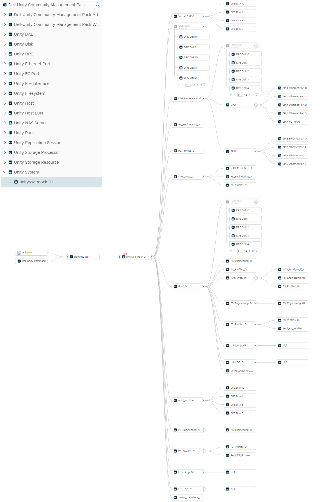
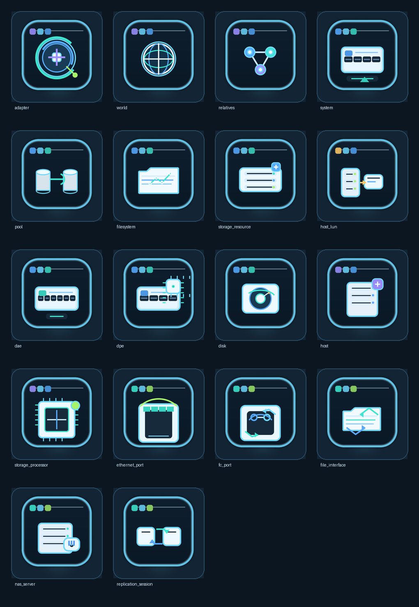

# Dell Unity Community Management Pack for VMware Aria Operations

Community VMware Aria Operations management pack for monitoring Dell EMC Unity / Unity XT storage platforms using the Dell Unity REST API.

This management pack was built with VMware Aria Management Pack Builder and is intended to provide Aria Operations visibility for Unity storage systems, including system health, pools, storage resources, file systems, NAS servers, host mappings, physical hardware components, ports, replication sessions, and Unity alerts.

> This is a community management pack. It is not an official Dell or Broadcom/VMware supported management pack.

## Release

| Item | Value |
| --- | --- |
| Management Pack | Dell-Unity Community Management Pack |
| Version | 1.3.8.23 |
| Author | Drew Mackay |
| Description | Aria Operations Community management pack for Dell Unity |
| Source type | Aria Management Pack Builder HTTP adapter |
| API used | Dell Unity REST API under `/api/types/...` |
| Authentication | Unity REST authentication using Basic credentials and Unity session/CSRF handling |
| Licence | MIT |

## Repository Contents

```text
.
├── LICENSE.md
├── README.md
├── PAK-Release
│   ├── Dell-Unity Community Management Pack-1.3.8.23.pak
│   └── Dell-Unity Community Management Pack-1.3.8.23_icons.pak
├── mp-builder
│   └── AriaMPBuilder-import-Unity.json
├── Images
│   └── CustomIcons.png
└── CustomIcons-tooling
    ├── inject_unity_custom_icons.py
    └── icons
        ├── adapter.png
        ├── adapter_instance.png
        ├── dae.png
        ├── disk.png
        ├── dpe.png
        ├── ethernet_port.png
        ├── fc_port.png
        ├── file_interface.png
        ├── filesystem.png
        ├── host.png
        ├── host_lun.png
        ├── nas_server.png
        ├── pool.png
        ├── relatives.png
        ├── replication_session.png
        ├── storage_processor.png
        ├── storage_resource.png
        ├── system.png
        ├── virtual_disk.png
        ├── vvol_block.png
        ├── vvol_file.png
        └── world.png
```

## Aria Topology

Aria Operations Topology view 



## Which PAK Should I Install?

Two PAK files are included:

| PAK | Use case |
| --- | --- |
| `Dell-Unity Community Management Pack-1.3.8.23.pak` | Standard MP Builder-generated PAK. Use this if you want the clean baseline output exactly as produced by MP Builder. |
| `Dell-Unity Community Management Pack-1.3.8.23_icons.pak` | Same management pack with custom Unity resource icons injected after the PAK was built. This is the recommended PAK for normal use. |

The icon-injected PAK does not intentionally change collection logic, API requests, metrics, relationships, dashboards, credentials, or adapter behaviour. It only updates image assets so Unity resource types are easier to recognise in Aria Operations.

## Custom Icons

The repository includes a custom icon set for Unity resources. The included PNG icons are 400 x 400 pixels.



## What It Monitors

The management pack discovers Unity resources through the Unity REST API and collects properties, capacity values, health values, topology identifiers, and alert data where available.

### Unity System

- System ID and name
- Model
- Serial number
- Software version
- Health value
- MAC address
- System UUID
- Platform

### Unity Pools

- Pool ID and name
- Total, used, and free capacity
- Preallocated and subscribed capacity
- RAID type
- Flash percentage
- Description
- Health value

### Unity Storage Resources

- Storage resource ID and name
- Resource type
- Total, allocated, used, and preallocated capacity
- Backing pool ID and name
- VMware UUID
- Replication type
- Snapshot count
- Description
- Health value

### Unity Filesystems

- Filesystem ID and name
- Description
- Total, used, allocated, and preallocated capacity
- Pool ID and name
- NAS server ID and name
- Storage resource ID and name
- Thin provisioning state
- Read-only state
- Deduplication percentage saved
- Health value

### Unity NAS Servers and File Interfaces

- NAS server ID, name, description, pool, and health
- File interface ID and name
- IP address and IP version
- VLAN ID
- Port ID and name
- Associated NAS server
- Health value

### Unity Hosts and Host LUNs

- Host ID and name
- Host description
- Host operating system type
- Host UUID
- Host type
- Host health value
- Host LUN ID
- Host LUN number
- Mapping type
- Associated host and storage resource

### Unity Hardware

The pack models key Unity hardware resources including:

- Unity DPE
- Unity DAE
- Unity Disk
- Unity Storage Processor
- Unity Ethernet Port
- Unity FC Port

Collected values include hardware IDs, names, models, slot numbers, average temperature, average power, serial numbers, health values, replacement state, capacity, WWN, MAC address, port speed, link status, and parent identifiers where exposed by the Unity REST API.

### Unity Replication Sessions

- Replication session ID and name
- Source resource ID and name
- Destination resource ID and name
- Sync state
- Status
- Sync progress
- Estimated remaining transfer time
- Health value

### Unity Alerts

The pack queries Unity alerts and maps them into Aria Operations events/alerts for the following areas:

- System alerts
- Pool alerts
- Storage resource alerts
- File system alerts
- NAS server alerts
- File interface alerts
- Host alerts
- Storage processor alerts
- Enclosure alerts
- Physical disk alerts
- Ethernet port alerts
- FC port alerts
- Replication session alerts

## Topology Model

The management pack creates Unity objects and relationships to provide a useful topology model inside Aria Operations.

Logical relationships include:

```text
Unity System
├── Unity Pool
│   ├── Unity Storage Resource
│   │   ├── Unity Filesystem
│   │   ├── Unity Host LUN
│   │   └── Unity Replication Session
│   ├── Unity Filesystem
│   ├── Unity NAS Server
│   │   ├── Unity Filesystem
│   │   └── Unity File Interface
│   └── Unity Disk
├── Unity DPE
│   ├── Unity Storage Processor
│   │   ├── Unity Ethernet Port
│   │   └── Unity FC Port
│   └── Unity Disk
├── Unity DAE
│   └── Unity Disk
├── Unity Storage Resource
├── Unity Filesystem
├── Unity NAS Server
└── Unity Disk

Unity Host
└── Unity Host LUN
```

The exact topology visible in Aria Operations can vary depending on the Unity model, available REST API data, mapped hosts, and populated relationship fields.

## Dell Unity REST API Endpoints Used

The pack uses Unity REST API endpoints under `/api/types`, including:

```text
types/system/instances
types/pool/instances
types/storageResource/instances
types/filesystem/instances
types/nasServer/instances
types/fileInterface/instances
types/host/instances
types/hostLUN/instances
types/storageProcessor/instances
types/dae/instances
types/disk/instances
types/ethernetPort/instances
types/fcPort/instances
types/replicationSession/instances
types/dpe/instances
types/alert/instances
```

## Requirements

### Aria Operations

- VMware Aria Operations with management pack installation rights.
- A collector or cloud proxy that can reach the Dell Unity REST API over HTTPS.
- Permission to add integrations/adapters and credentials.

### Dell Unity

- Dell EMC Unity, Unity XT, or UnityVSA with REST API access enabled.
- A Unity user account with read access to system, pool, storage, filesystem, NAS, host, hardware, replication, and alert data.
- HTTPS access from the Aria Operations collector/cloud proxy to the Unity management address.

### Network

Default traffic flow:

```text
Aria Operations Collector / Cloud Proxy -> Dell Unity HTTPS / TCP 443
```

No inbound connection from Dell Unity to Aria Operations is required for normal polling.

## Installing the PAK in Aria Operations

1. Log in to Aria Operations with an account that can install management packs.
2. Go to **Administration > Integrations > Repository**.
3. Click **Add** or **Upload**.
4. Select the recommended PAK:

   ```text
   PAK-Release/Dell-Unity Community Management Pack-1.3.8.23_icons.pak
   ```

5. Accept the prompts and allow the PAK to install.
6. Wait for the installation to complete successfully.
7. Go to **Administration > Integrations**.
8. Find **Dell-Unity Community Management Pack**.
9. Click **Add Account**.
10. Enter the Dell Unity connection details and credentials.

## Adapter Instance Settings

| Setting | Description | Example |
| --- | --- | --- |
| Hostname | Dell Unity management FQDN or IP address | `<UNITY_FQDN_OR_IP>` |
| Port | Unity HTTPS port | `443` |
| SSL | SSL validation mode | `NO_VERIFY` for lab/self-signed certificates, `VERIFY` for trusted certificates |
| Connection Timeout | HTTP timeout in seconds | `30` |
| Max Concurrent Requests | Maximum concurrent REST calls | `15` |
| Maximum Retries | Retry count for failed calls | `2` |
| Minimum VMware Aria Operations Severity | Minimum Unity event severity to collect | `WARNING` |

## Credentials

Create or select credentials for Dell Unity:

| Field | Description |
| --- | --- |
| Username | Dell Unity REST API username |
| Password | Dell Unity REST API password |

The password is stored by Aria Operations as a credential secret. Do not store Dell Unity credentials in the repository.

## Test Connection and First Collection

After adding the adapter instance:

1. Click **Test Connection**.
2. Confirm the test passes.
3. Save the adapter instance.
4. Allow at least one full collection cycle to complete.
5. Confirm Unity objects appear in **Inventory**.
6. Review topology and dashboards after the first successful collection.

The first collection can take several minutes while Aria Operations creates the object inventory, relationships, alerts, and dashboard data.

## Included Dashboards

The PAK includes the following dashboards:

```text
EMC-Unity Management Pack/EMC-Unity Executive Overview
EMC-Unity Management Pack/EMC-Unity Capacity and Forecasting
EMC-Unity Management Pack/EMC-Unity File Services and Replication
EMC-Unity Management Pack/EMC-Unity Hardware and Alerts
```

These dashboards are intended to provide a first-pass operational view of Unity health, capacity, file services, replication, hardware, and alert status.

Dashboard receiver-widget behaviour can vary depending on Aria Operations version and widget configuration. For detailed validation, also review the Aria Operations Inventory topology view and object metric pages.

## Importing the MP Builder JSON for Editing

The MP Builder export is included for users who want to inspect, modify, or rebuild the management pack in Aria Management Pack Builder.

File:

```text
mp-builder/AriaMPBuilder-import-Unity.json
```

### Import Steps

1. Log in to Aria Management Pack Builder.
2. Choose the option to import an existing management pack design.
3. Select:

   ```text
   mp-builder/AriaMPBuilder-import-Unity.json
   ```

4. Import the design.
5. Review the source configuration.
6. Update the Unity hostname default if required.
7. Review the Unity REST authentication/session settings.
8. Run source tests from MP Builder.
9. Make any required changes.
10. Build a new PAK from MP Builder.

### Important Notes When Editing

- Preserve the Unity REST `/api/types/...` approach unless you are deliberately changing the API model.
- Preserve the Unity session/CSRF token handling.
- Review request chaining and parent/child relationship expressions before changing object identifiers.
- If you change object type names, update the icon mapping and icon injection process.
- Re-test dashboards after changing object names, relationships, or metric keys.

## Running the Custom Icon Injector

The repository includes the icon injector used to create the icon-enhanced PAK.

Script:

```text
CustomIcons-tooling/inject_unity_custom_icons.py
```

Icons:

```text
CustomIcons-tooling/icons
```

### Icon Requirements

The injector expects PNG files for each mapped resource type. The included icons are 400 x 400 PNG files.

Expected icon filenames:

```text
adapter.png
world.png
relatives.png
system.png
pool.png
filesystem.png
storage_resource.png
host_lun.png
dae.png
dpe.png
disk.png
host.png
storage_processor.png
ethernet_port.png
fc_port.png
file_interface.png
nas_server.png
replication_session.png
```

The repository also contains additional icon files that may be useful for future extension work, including `virtual_disk.png`, `vvol_block.png`, `vvol_file.png`, and `adapter_instance.png`.

### Python Dependency

The injector uses Python and Pillow:

```powershell
python -m pip install pillow
```

### Basic Usage

From the root of the repository:

```powershell
python .\CustomIcons-tooling\inject_unity_custom_icons.py `
  ".\PAK-Release\Dell-Unity Community Management Pack-1.3.8.23.pak" `
  --icons-dir ".\CustomIcons-tooling\icons" `
  --output ".\PAK-Release\Dell-Unity Community Management Pack-1.3.8.23_icons.pak"
```

### What the Injector Changes

The injector patches image assets in the PAK and nested adapter archive. It does not intentionally modify:

- API requests
- Adapter credentials
- Dashboards
- Object model
- Relationships
- Metrics or properties
- Package metadata/version

After running the injector, install the generated icon PAK into a test Aria Operations environment and confirm the icons display as expected.

## Optional Unity API Emulator for Lab Builds

If you do not have access to a licensed UnityVSA or physical Unity appliance, the following community emulator may be useful for lab work and MP Builder testing:

```text
https://github.com/mackayd/Unity-API-Emulator
```

The emulator is intended for development and testing only. Always validate the management pack against a real Unity REST API before treating the pack as production-ready.

## Known Limitations

- This is an initial community release and should be validated against a real Unity appliance before production use.
- Some parent/child relationships may require further tuning after validation against real Unity REST API responses.
- Dashboard interactions may require adjustment depending on Aria Operations version and widget behaviour.
- Object availability depends on what the target Unity system exposes through the REST API.
- Capacity, health, and hardware fields may vary between Unity models, Unity OE versions, UnityVSA, and physical appliances.
- The pack is not an official Dell or Broadcom/VMware supported management pack.

## Validation Checklist

After installing the PAK and creating an adapter instance, confirm:

- Test connection succeeds.
- Unity System object is discovered.
- Pools are discovered and report capacity values.
- Storage resources and filesystems are discovered.
- NAS servers and file interfaces appear where configured.
- Hosts and host LUN mappings appear where configured.
- DPE, DAE, disk, storage processor, Ethernet port, and FC port objects appear where exposed by the API.
- Alerts are collected and mapped to Aria Operations events/alerts.
- Relationships appear correctly in the Inventory topology view.
- Dashboards populate after at least one full collection cycle.
- Custom icons display correctly when using the `_icons.pak` file.

## Troubleshooting

### Test Connection Fails

Check:

- Unity hostname or IP is correct.
- Unity HTTPS port is reachable from the Aria Operations collector or cloud proxy.
- DNS resolution works if using an FQDN.
- Firewall rules allow outbound TCP 443 from the collector/cloud proxy to Unity.
- Credentials are correct.
- The account has read permissions for the REST API.
- SSL mode is appropriate for the certificate in use.

For labs using self-signed certificates, use `NO_VERIFY`. For production environments with trusted certificates, use `VERIFY` where possible.

### Objects Do Not Appear

Check:

- At least one full collection cycle has completed.
- The Unity REST API returns data for the relevant endpoint.
- The account has permission to read the relevant Unity object type.
- The object exists and is populated on the target Unity system.
- MP Builder relationship expressions still match the returned API data if the JSON has been modified.

### Dashboards Are Empty

Check:

- The adapter instance is collecting successfully.
- Unity resource objects exist in Inventory.
- The dashboard widgets are pointed at the correct resource kinds.
- A resource has been selected where receiver widgets depend on a selected object.

## Repository Security Notes

Do not commit real Unity credentials, lab credentials, customer FQDNs, customer IP addresses, session tokens, exported logs, or private screenshots to this repository.

Before publishing a new release, review:

- `mp-builder/AriaMPBuilder-import-Unity.json`
- Any generated PAK files
- Any screenshots under `Images/`
- Any custom scripts under `CustomIcons-tooling/`

Credential values should be stored only in Aria Operations credential objects, not in source control.

## Versioning

The PAK version included in this repository is `1.3.8.23`.

If you rebuild the pack from MP Builder, increment the version and update:

- PAK filename
- MP Builder export filename, if renamed
- README release table
- Installation examples
- Icon injector examples
- Release notes, if added later

## Licence

This repository is licensed under the MIT Licence. See `LICENSE.md` for details.

## Disclaimer

This repository is provided as a community example for VMware Aria Operations management pack development. Use at your own risk and validate thoroughly in a non-production environment before deploying to production.
